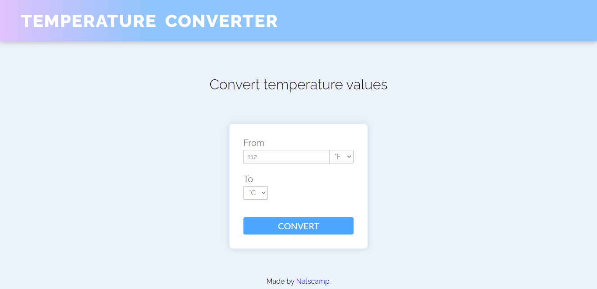

# DevProjects - Temperature converter website

This is an open source project from [DevProjects](http://www.codementor.io/projects). Feedback and questions are welcome!
Find the project requirements here: [Temperature converter website](https://www.codementor.io/projects/web/temperature-converter-website-atx32dy7mf)

## Tech/framework used

Built with HTML/CSS/JS

## Screenshots and demo

[Check it out here](https://temperature-converter-challenge.vercel.app/)

## Installation

Clone the repository and open the index.html file.

## License

MIT
